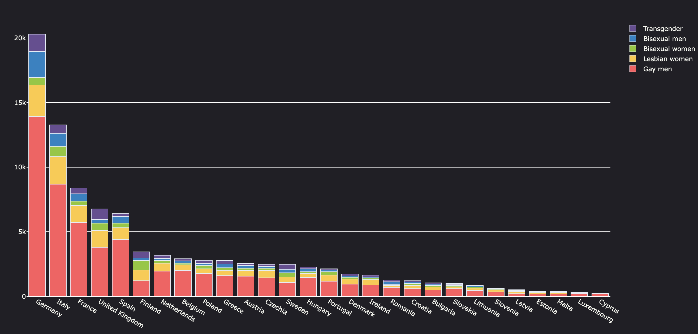
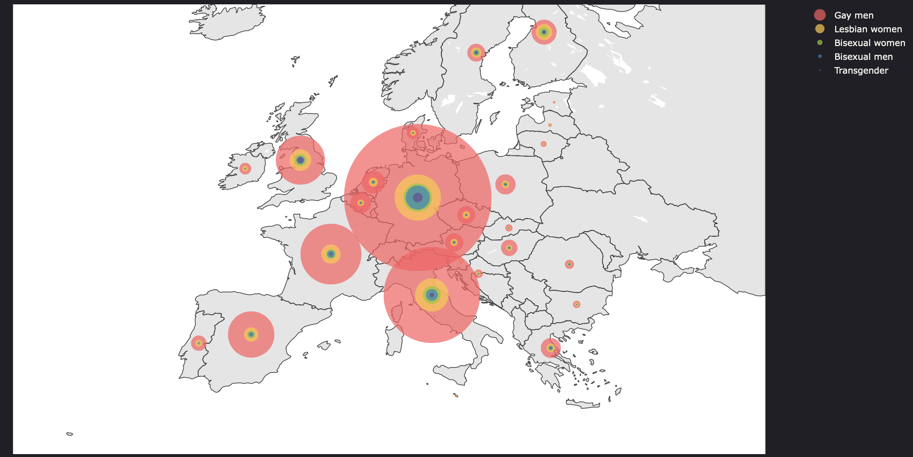
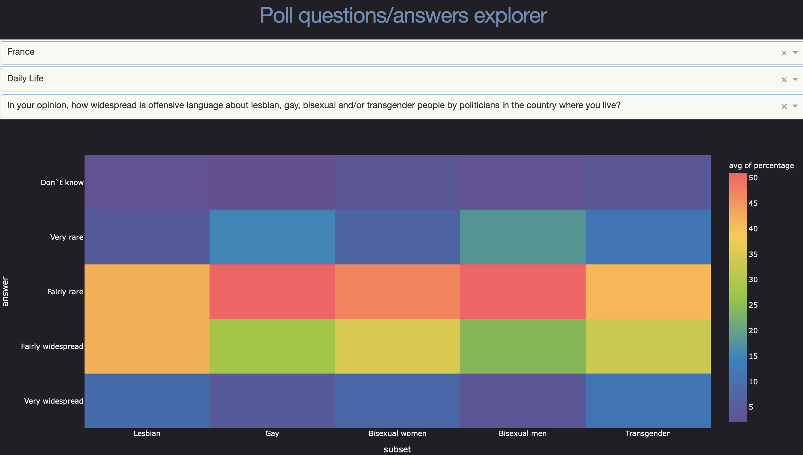

# Rapport d'activité - UE3

## 0 - Introduction

Les personnes LGBTQ+ sont aujourd'hui encore discriminées partout dans le monde, y compris en Union Européenne.
Pour lutter contre les discriminations envers les minorités sexuelles et de genre, l'agence européenne Fundamental Rights Agency (FRA) effectue régulièrempent des sondages sur auprès des personnes LGBTQ+ vivant sur le sol europée. A cet effet, elle fait ainis paraitre les données relatives à ces sondages sur internet.
Dans le cadre de se module, nous nous interesserons à la visualisation des données collectées lors de l'un de ces sondages, celui effectué en 2012.
Nous expliquerons ici quelle est la teneur de ce jeu de données, discuterons de la mise en place de solutions pour le visualiser, les conclusions que nous pouvons tirer de ces visuels ainsi que des améliorations que nous proposons pour cet outil.

## 1 - Données

### a. Données brutes
Dans le cadre de l'enquête décrite en introduction, la FRA a interrogé 93079 personnes sur 28 pays. Il s'agissait de la plus grande enquête du monde à ce sujet [[source]](https://fra.europa.eu/fr/news/2012/93-000-personnes-ont-participe-lenquete-lgbt-de-la-fra-ce-qui-fait-delle-la-plus-grande).
La population se divise en cinq sous-ensembles : femmes lesbiennes, hommes gay, femmes et hommes bisexuels et personnes transgenre. Les questions posées à la population se divisent en cinq catégories : 
  - Vie quotidienne,
  - Discriminations,
  - Violences et harcèlement,
  - Connaissance des droits des personnes LGBT,
  - Questions particulières aux personnes transgenre.
En pratique, chaque fichier contient la répartition des réponses a chaque question des personnes sondées en fonction du pays, du sous-ensemble et de la question posée. On donne par exemple le chéma du fichier `csv` concernant la vie quotidienne : 
```yaml 
daily_life:
    - CountryCode
    - subset
    - question_code
    - question_label
    - answer
    - percentage
    - notes
```
Il est enfin à noter que nous disposons d'un sixième fichier nous donnant la répartition des personnes sondées par pays et par sous-groupe.

### b. Traitements

Nous souhaitons garder les données les plus simples possibles, ainsi le prétraitement est minimal. Il comporte simplement une mise à jour du format des pourentages ainsi que l'ajout de l'information du nom de chaque pays - chaque pays est initialement identifié par un code ISO.

## 2 - Visualisation

Il est à noter que l'application de visualisation est en ligne en suivant [ce lien](https://alonely.place/vfl/).

### a. Répartition de la population sondée

Nous proposons deux visuels pour se rendre compte de la répartition de la population qui a été sondée.  
La première visualisation consiste en un histogramme représentant le nombre de personnes sondées en fontion de leur localisation géographique ainsi que de leur sous-groupe (en couleur) (cf. Figure 1).  

  
_Fig. 1 :_ Histogramme de la population sondée

La seconde figure représente la même répartition mais cette fois sous forme de pastilles de couleurs concentrique sur une carte (cf. Figure 2).

  
_Fig. 2 :_ Répartition géographique des personnes sondées

### b. Réponses aux questions du sondage

Afin d'explorer les réponses fournies par l'échantillon de populaton questionné, on propose un système de heatmap interactive permettant de selectionner un pays cible, l'une des cinq thématiques sus-citées ainsi que l'une des question de cette thématiques que l'on souhaite explorer.
S'affiche ensuite un heatmap des réponses à la question selectionnée en fonction du sous-groupe de personnes. Une reproduction est disponnible en Figure 3.

  
_Fig. 3 :_ Réponses à la question sur la vie politique en France.

## 3 - Analyse

Les deux premiers graphiques nous apprennent d'une part que dans les pays de l'ouest de la péninsule européenne sont de manière absolue surreprésentés. Il en va de même pour la population d'hommes gay, qui représente plus de la majorité des personnes sondées par pays dans une majorité des cas.  

## 4 - Conclusion

Cette étude nous à permis de mettre en place une solution interactive de visualisation des réponses aux questions de l'étude de la FRA sur les personnes LGBT.  
Malgré son aspect intuitif, cette solution reste minimaliste par essence et pourrait être étoffée. Parmi les pistes d'amélioration, on peut notamment mentionner une manière plus intuitive de selectionner ou d'explorer les questions (au nombre de 164). On peut aussi citer un moyen de se rendre compte de l'accord ou du desaccord de la population sur une question donnée.
